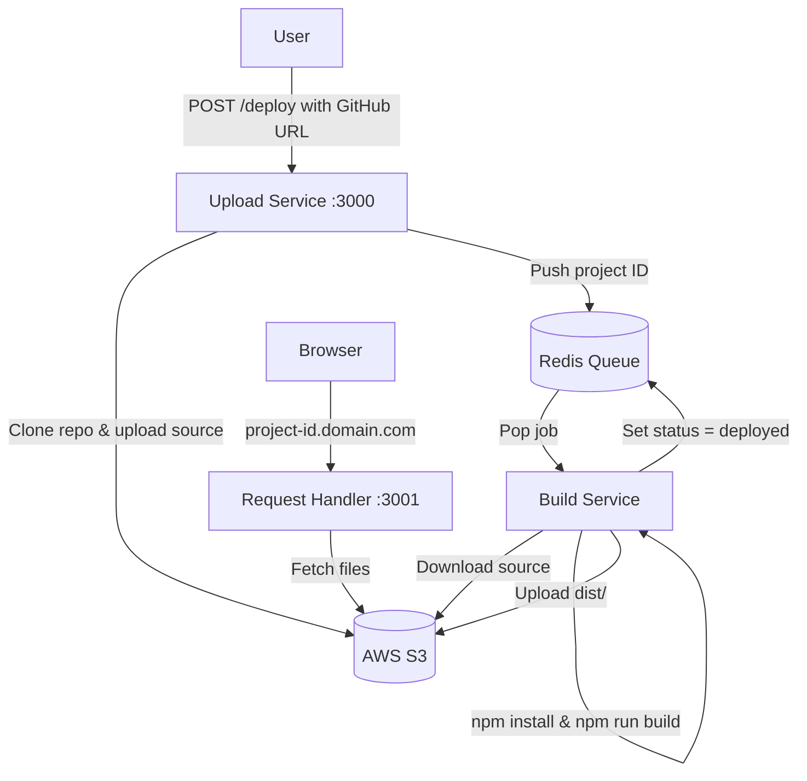

<p align="center">
  
</p>

<p align="center">
  
  
</p>

---

## Description

Zenith is a scalable, distributed deployment platform that mimics the core functionality of **Vercel**. Paste a GitHub repo URL, and Zenith will clone it, build it inside a Docker container, upload the artifacts to S3, and serve the site on a custom subdomain — all automatically.

🔗 **Demo Video:** [Watch on Google Drive](https://drive.google.com/file/d/1k1Eu60vR_z3x7omq-2VDyS0RY70C56P0/view?usp=sharing)

## Features

- **One-Click Deploy:** Submit a GitHub URL and get a live site in seconds.
- **Containerized Builds:** Every build runs inside Docker for isolation and reproducibility.
- **Custom Subdomains:** Each deployment is served at `<project-id>.yourdomain.com`.
- **S3 Artifact Storage:** Source code and build output are stored in AWS S3.
- **Redis Build Queue:** Deployments are queued via Redis for reliable, async processing.
- **SPA Fallback:** The request handler falls back to `index.html` for client-side routing.
- **Microservices Architecture:** Three independent services communicating through S3 and Redis.
- **Monorepo with Workspaces:** All services managed in a single repo using npm workspaces.

## Tech Stack

| Layer              | Technology                         |
| :----------------- | :--------------------------------- |
| **Language**       | TypeScript (Node.js)               |
| **Framework**      | Express.js                         |
| **Orchestration**  | Docker & Docker Compose            |
| **Architecture**   | Microservices (Monorepo)           |
| **Queue System**   | Redis (Upstash / Local)            |
| **Object Storage** | AWS S3                             |
| **Deployment**     | AWS EC2 / DigitalOcean Droplet     |
| **Libraries**      | Simple-Git, AWS-SDK v3, mime-types |

## System Architecture



## Installation

### 1. Clone the repository

```bash
git clone https://github.com/PraveenUppar/Zenith.git
cd Zenith
```

### 2. Environment Setup

Create a `.env` file in the project root:

```env
# AWS Credentials
AWS_ACCESS_KEY_ID=your_access_key
AWS_SECRET_ACCESS_KEY=your_secret_key
AWS_REGION=ap-south-1

# Redis Connection
UPSTASH_REDIS_REST_URL=your_redis_url
```

### 3. Run with Docker Compose (Recommended)

```bash
docker-compose up -d
```

This starts all three services:

| Service         | Port | Description               |
| :-------------- | :--- | :------------------------ |
| Upload Service  | 3000 | Accepts deploy requests   |
| Request Handler | 3001 | Serves deployed sites     |
| Build Service   | —    | Background queue consumer |

### 4. Local Development (Without Docker)

```bash
# Install all dependencies (from root)
npm install

# Build all services
npm run build --workspaces

# Start each service in separate terminals
node apps/upload-service/dist/index.js
node apps/build-service/dist/index.js
node apps/request-handler/dist/index.js
```

## Going Live

### Server Setup

1. **Launch a VPS** — AWS EC2 (t3.small recommended) or DigitalOcean Droplet running Ubuntu.
2. **Install Docker & Docker Compose** on the server.
3. **Add Swap Memory** (critical for cheap servers):
   ```bash
   sudo fallocate -l 1G /swapfile &&
   sudo chmod 600 /swapfile &&
   sudo mkswap /swapfile &&
   sudo swapon /swapfile
   ```

### Deploy

```bash
git clone https://github.com/PraveenUppar/Zenith.git
cd Zenith
# Create .env with your real AWS keys and Redis URL
docker-compose up -d
```

### DNS Configuration

Set up **wildcard DNS** so `<project-id>.yourdomain.com` resolves to your server:

| Record Type | Host | Value       |
| :---------: | :--: | :---------- |
|      A      | `@`  | Your VPS IP |
|      A      | `*`  | Your VPS IP |

### Reverse Proxy (Nginx)

Route traffic from port 80 to the correct service:

- `api.yourdomain.com` → `localhost:3000` (Upload Service)
- `*.yourdomain.com` → `localhost:3001` (Request Handler)

> **Quick Alternative:** Bind the Request Handler directly to port 80 (`"80:3001"` in `docker-compose.yml`) and keep the Upload API on port 3000.

## Contributing

Contributions are welcome! To get started:

1. Fork the repository.
2. Create a new branch (`git checkout -b feature/your-feature`).
3. Commit your changes (`git commit -m 'Add your feature'`).
4. Push to the branch (`git push origin feature/your-feature`).
5. Open a Pull Request.

## Support

If you encounter any issues or have questions, please [open an issue](https://github.com/PraveenUppar/Zenith/issues) on GitHub.

## Project Status

This project is actively maintained. Contributions, feedback, and suggestions are always welcome!

---
